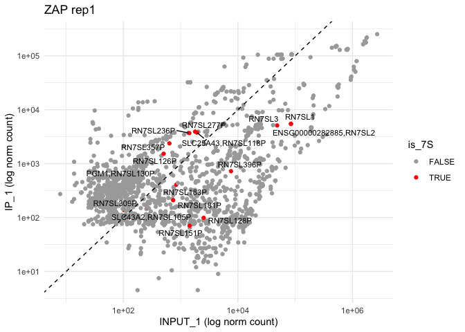
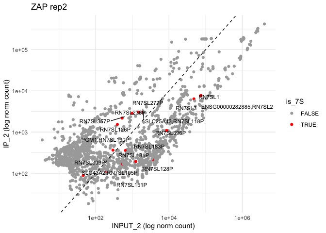
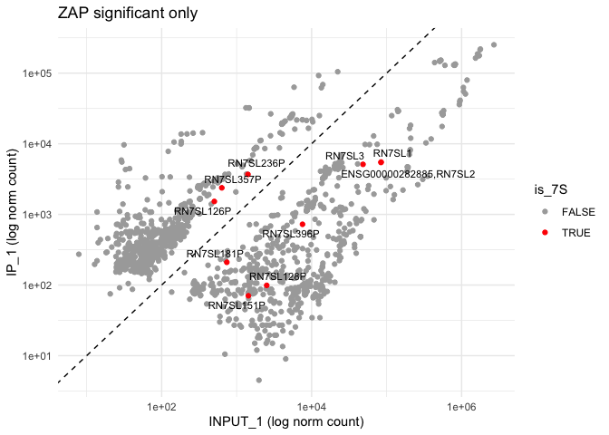
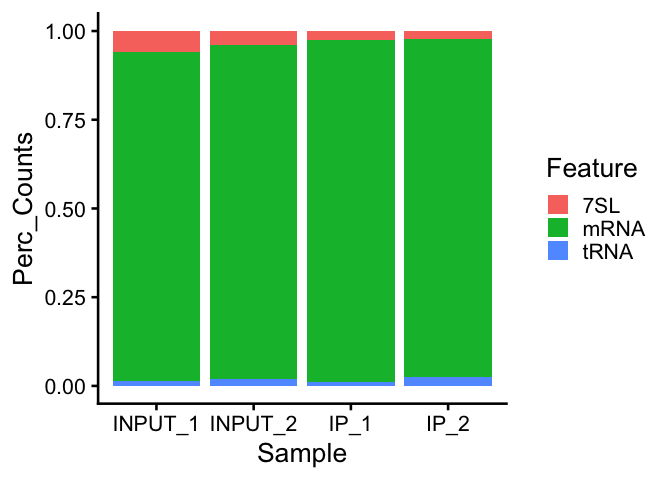
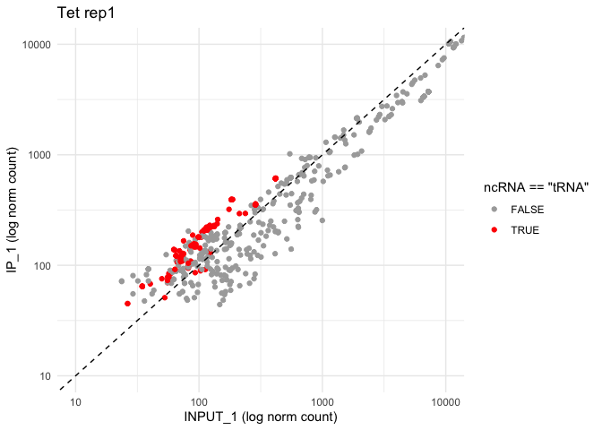
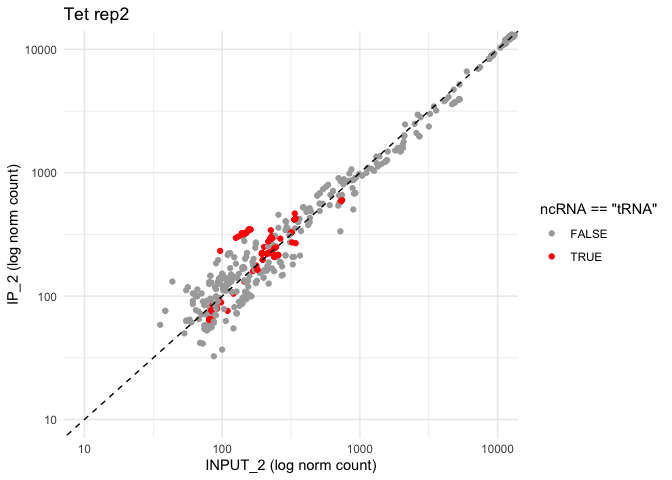
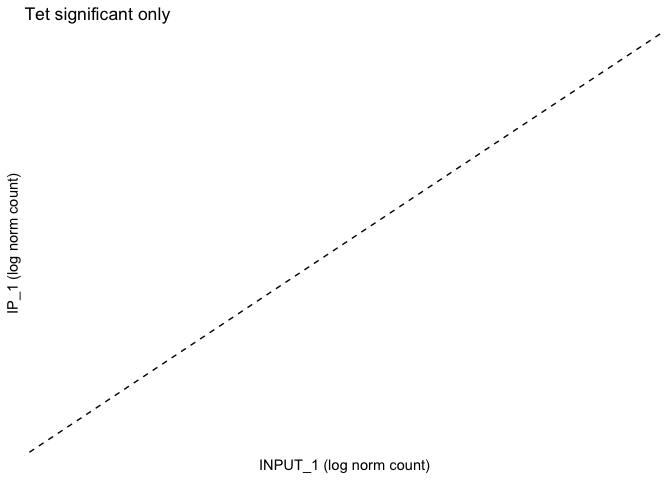

eCLIP
================
Wilfried Guiblet
2025-09-25

# Libraries

# Environment

``` bash
srun --pty -p norm --ntasks=64 bash
cd /mnt/gridftp/guibletwm/CCBRRBL16

module load mamba
mamba create -n eclipV2
mamba activate eclipV2

mamba install bioconda::seqkit
mamba install bioconda::umi_tools

module load singularity
module load python
```

# ZAP

## YeoLab eCLIP

### Prep STAR

``` bash

# STAR index hg38

singularity \
    --quiet \
    run \
    --contain \
    --ipc \
    --cleanenv \
    --no-eval \
    --userns \
    --home \
    /mnt/gridftp/guibletwm/CCBRRBL16/:/vyjYpl/ \
    --pwd \
    /vyjYpl \
    /mnt/gridftp/guibletwm/CCBRRBL16/brianyee_star:2.7.6a.sif \
    STAR \
      --runThreadN 64 \
      --runMode genomeGenerate \
      --genomeDir STAR_hg38/ \
      --genomeFastaFiles STAR_hg38/hg38.fa \
      --sjdbGTFfile STAR_hg38/gencode.v47.annotation.gtf \
      --sjdbOverhang 100 \
      --limitSjdbInsertNsj 4807600 

# STAR index repeatmasker hg38

singularity \
    --quiet \
    run \
    --contain \
    --ipc \
    --cleanenv \
    --no-eval \
    --userns \
    --home \
    /mnt/gridftp/guibletwm/CCBRRBL16/:/vyjYpl/ \
    --pwd \
    /vyjYpl \
    /mnt/gridftp/guibletwm/CCBRRBL16/brianyee_star:2.7.6a.sif \
    STAR \
      --runThreadN 64 \
      --runMode genomeGenerate \
      --genomeDir STAR_hg38_repeat/ \
      --genomeFastaFiles STAR_hg38_repeat/hg38.fa \
      --sjdbGTFfile STAR_hg38_repeat/rmsk.hg38.gtf \
      --sjdbOverhang 100 \
      --limitSjdbInsertNsj 4807600 
```

### Run eCLIP

``` bash
cwltool --parallel --singularity --tmpdir-prefix /scratch/cluster_scratch/guibletwm/ --cachedir  /scratch/cluster_scratch/guibletwm/ --leave-tmpdir /mnt/gridftp/guibletwm/CCBRRBL16/eCLIP/cwl/wf_get_peaks_scatter_se.cwl /mnt/gridftp/guibletwm/CCBRRBL16/manifests/ZAP.yaml

cwltool --parallel --singularity --tmpdir-prefix /scratch/cluster_scratch/guibletwm/ --cachedir  /scratch/cluster_scratch/guibletwm/ --leave-tmpdir /mnt/gridftp/guibletwm/CCBRRBL16/merge_peaks/cwl/wf_get_reproducible_eclip_peaks.cwl /mnt/gridftp/guibletwm/CCBRRBL16/manifests/ZAP.merge.yaml
```

``` bash
python post_process_eCLIP.py --yaml_file manifests/ZAP.yaml --directory ZAP > ZAP.report.txt
```

Problem: target is a repetitive element. Let’s realign and keep repeats.

## ReAlign

### Run STAR

``` bash

for sample in 'rep1_IP' 'rep2_IP' 'rep1_INPUT' 'rep2_INPUT' ; do

  singularity \
      --quiet \
      run \
      --contain \
      --ipc \
      --cleanenv \
      --no-eval \
      --userns \
      --home \
      /mnt/gridftp/guibletwm/CCBRRBL16/:/vyjYpl/ \
      --pwd \
      /vyjYpl \
      /mnt/gridftp/guibletwm/CCBRRBL16/brianyee_star:2.7.6a.sif \
      STAR \
        --runMode alignReads \
        --runThreadN 64 \
        --genomeDir STAR_hg38 \
        --genomeLoad NoSharedMemory \
        --readFilesIn \
        ZAP/ZAP.${sample}.umi.r1.fqTrTr.sorted.fq.gz \
        --readFilesCommand zcat \
        --outSAMunmapped None \
        --outFilterMultimapNmax 10000 \
        --outFilterMultimapScoreRange 5 \
        --outFileNamePrefix Realign/ZAP.${sample} \
        --outSAMattributes All \
        --outSAMtype BAM Unsorted \
        --outFilterType Normal \
        --outReadsUnmapped Fastx \
        --outFilterScoreMin 0 \
        --outSAMattrRGline ID:foo \
        --outStd Log \
        --alignEndsType Local \
        --outBAMcompression 10 \
        --outSAMmode Full
  
  samtools sort --threads 64 -o Realign/ZAP.${sample}_Aligned.sorted.bam Realign/ZAP.${sample}_Aligned.out.bam
  samtools index --threads 64 Realign/ZAP.${sample}_Aligned.sorted.bam 
  umi_tools dedup -I Realign/ZAP.${sample}_Aligned.sorted.bam -S Realign/ZAP.${sample}.deduped.bam -L dedup.log --method=unique
  samtools index --threads 64 -M Realign/ZAP.*.deduped.bam
  
done
```

### Peak Calling

``` bash

singularity shell -B $(pwd)/:/data2/ ctk.sif
export PERL5LIB=/opt/conda/lib/czplib

for sample in 'rep1_IP' 'rep2_IP' 'rep1_INPUT' 'rep2_INPUT' ; do

  bedtools bamtobed -split -i ${sample}.deduped.bam > ${sample}.deduped.bed

  /opt/conda/lib/ctk/tag2peak.pl \
    -big -ss \
    -p 0.001 --multi-test \
    --valley-seeking \
    --valley-depth 0.90 \
    Realign/ZAP.${sample}.deduped.bed Realign/ZAP.${sample}.CTKpeaks.bed \
    --out-boundary Realign/ZAP.${sample}.CTKpeaks.boundary.bed \
    --out-half-PH Realign/ZAP.${sample}.CTKpeaks.halfPH.bed \
    -minPH 100
    
done

cat Realign/ZAP.*.CTKpeaks.boundary.bed | bedtools sort -i - | bedtools merge -s -i - -c 6 -o distinct | awk -v FS='\t' -v OFS='\t' '{print $1,$2,$3,"merged_peak","0",$4}' > Realign/ZAP.CTKpeaks.merged.formatted.bed
```

### Annotate

``` bash
# Same Strand

bedtools intersect -s -wao \
          -a Realign/ZAP.CTKpeaks.merged.formatted.bed \
          -b Realign/rmsk.hg38.custom.bed \
            > Realign/ZAP.CTKpeaks.merged.rmsk.SameStrand.bed

bedtools intersect -s -wao \
          -a Realign/ZAP.CTKpeaks.merged.formatted.bed \
          -b Realign/gencode.v44.annotation.bed \
            > Realign/ZAP.CTKpeaks.merged.gencode.SameStrand.bed

bedtools intersect -s -wao \
          -a Realign/ZAP.CTKpeaks.merged.formatted.bed \
          -b Realign/hg38.GENCODE_V44.UCSC.introns.bed \
          | awk 'BEGIN {FS = "\t"; OFS = "\t"} $10 != "." {split($10, arr, "_"); $14 = arr[3]} $10 == "." { $14 = "." } 1' \
            > Realign/ZAP.CTKpeaks.merged.introns.SameStrand.bed

bedtools intersect -s -wao \
          -a Realign/ZAP.CTKpeaks.merged.formatted.bed \
          -b Realign/ncRNA.bed \
            > Realign/ZAP.CTKpeaks.merged.ncRNA.SameStrand.bed

bedtools intersect -s -wao \
          -a Realign/ZAP.CTKpeaks.merged.formatted.bed \
          -b Realign/hg38.GENCODE_V44.UCSC.5UTR.bed Realign/hg38.GENCODE_V44.UCSC.3UTR.bed \
          -names 5UTR 3UTR \
            > Realign/ZAP.CTKpeaks.merged.UTRs.SameStrand.bed
            
     
# Opposite Strand
     
bedtools intersect -S -wao \
          -a Realign/ZAP.CTKpeaks.merged.formatted.bed \
          -b Realign/rmsk.hg38.custom.bed \
            > Realign/ZAP.CTKpeaks.merged.rmsk.OppoStrand.bed

bedtools intersect -S -wao \
          -a Realign/ZAP.CTKpeaks.merged.formatted.bed \
          -b Realign/gencode.v44.annotation.bed \
            > Realign/ZAP.CTKpeaks.merged.gencode.OppoStrand.bed

bedtools intersect -S -wao \
          -a Realign/ZAP.CTKpeaks.merged.formatted.bed \
          -b Realign/hg38.GENCODE_V44.UCSC.introns.bed \
          | awk 'BEGIN {FS = "\t"; OFS = "\t"} $10 != "." {split($10, arr, "_"); $14 = arr[3]} $10 == "." { $14 = "." } 1' \
            > Realign/ZAP.CTKpeaks.merged.introns.OppoStrand.bed

bedtools intersect -S -wao \
          -a Realign/ZAP.CTKpeaks.merged.formatted.bed \
          -b Realign/ncRNA.bed \
            > Realign/ZAP.CTKpeaks.merged.ncRNA.OppoStrand.bed

bedtools intersect -S -wao \
          -a Realign/ZAP.CTKpeaks.merged.formatted.bed \
          -b Realign/hg38.GENCODE_V44.UCSC.5UTR.bed Realign/hg38.GENCODE_V44.UCSC.3UTR.bed \
          -names 5UTR 3UTR \
            > Realign/ZAP.CTKpeaks.merged.UTRs.OppoStrand.bed       
            

python MergeAnnotations.py \
  --SameStrandRMSK Realign/ZAP.CTKpeaks.merged.rmsk.SameStrand.bed \
  --SameStrandGenCode Realign/ZAP.CTKpeaks.merged.gencode.SameStrand.bed \
  --SameStrandIntrons Realign/ZAP.CTKpeaks.merged.introns.SameStrand.bed \
  --SameStrandncRNA Realign/ZAP.CTKpeaks.merged.ncRNA.SameStrand.bed \
  --SameStrandUTRs Realign/ZAP.CTKpeaks.merged.UTRs.SameStrand.bed \
  --OppoStrandRMSK Realign/ZAP.CTKpeaks.merged.rmsk.OppoStrand.bed \
  --OppoStrandGenCode Realign/ZAP.CTKpeaks.merged.gencode.OppoStrand.bed \
  --OppoStrandIntrons Realign/ZAP.CTKpeaks.merged.introns.OppoStrand.bed \
  --OppoStrandncRNA Realign/ZAP.CTKpeaks.merged.ncRNA.OppoStrand.bed \
  --OppoStrandUTRs Realign/ZAP.CTKpeaks.merged.UTRs.OppoStrand.bed \
  --Output Realign/ZAP.CTKpeaks.merged.annotation_complete.txt            
```

``` bash
awk -v FS='\t' -v OFS='\t' 'NR>1 {gsub(/[ \t]/,"",$8); gsub(/[ \t]/,"",$10); gsub(/[ \t]/,"",$17) ; print $2,$3,$4,$8,$10,$6,$17}' Realign/ZAP.CTKpeaks.merged.annotation_complete.txt  | bedtools multicov -s -bed - -bams Realign/ZAP.rep1_IP.deduped.bam Realign/ZAP.rep2_IP.deduped.bam Realign/ZAP.rep1_INPUT.deduped.bam Realign/ZAP.rep2_INPUT.deduped.bam > Realign/ZAP.CTKpeaks.merged.annotation_complete.counts
```

### DE Analysis

``` r
input <- read.table('/Users/guibletwm/Lab_Work/CCRRBL-16/ZAP.CTKpeaks.merged.annotation_complete.counts',header=FALSE,sep="\t")

colnames(input) <- c('chrom', 'start', 'end','gene_name','gene_type', 'strand', 'ncRNA','IP_1', 'IP_2', 'INPUT_1', 'INPUT_2')
rownames(input) <- paste(input$chrom, input$start, input$end, input$strand, input$gene_name, input$gene_type, sep='|')

counts <- input[,c('IP_1', 'IP_2', 'INPUT_1', 'INPUT_2')]
#rownames(counts) <- paste(input$chrom, input$start, input$end, input$strand, sep='|')
counts <- data.frame(counts)
conditions <- c(rep('IP', 2), rep('INPUT', 2))

dds <- DESeqDataSetFromMatrix(countData = counts,
                              colData = data.frame(condition = conditions),
                              design = ~ condition)

dds$condition <- relevel(dds$condition, ref = "INPUT")

smallestGroupSize <- 3
keep <- rowSums(counts(dds) >= 50) >= smallestGroupSize
dds <- dds[keep,]

dds <- DESeq(dds)
res <- results(dds)
summary(res)
```

    ## 
    ## out of 1728 with nonzero total read count
    ## adjusted p-value < 0.1
    ## LFC > 0 (up)       : 699, 40%
    ## LFC < 0 (down)     : 712, 41%
    ## outliers [1]       : 0, 0%
    ## low counts [2]     : 0, 0%
    ## (mean count < 48)
    ## [1] see 'cooksCutoff' argument of ?results
    ## [2] see 'independentFiltering' argument of ?results

``` r
sum(res$padj < 0.05, na.rm=TRUE)
```

    ## [1] 1351

``` r
resOrdered <- res[order(res$padj),]
resOrdered <- resOrdered[which(resOrdered$padj < 0.05),]

write.table(as.data.frame(resOrdered), file='/Users/guibletwm/Lab_Work/CCRRBL-16/CTKpeaks.deseq.txt', sep='\t')

norm_counts <- counts(dds, normalized = TRUE)
toplot <- merge(input[,c('chrom', 'start', 'end','gene_name','gene_type', 'strand', 'ncRNA')], norm_counts, by = 0)

# Find which rows are 7S
toplot <- toplot %>%
  mutate(is_7S = grepl("RN7SL1|RN7SL2|RN7SL3", gene_name))


ggplot(data = toplot) +
  geom_point(aes(y=IP_1, x=INPUT_1, color = is_7S)) +
  scale_color_manual(values = c("FALSE" = "darkgrey", "TRUE" = "red")) +
  labs(title = 'ZAP rep1', x = "INPUT_1 (log norm count)", y = "IP_1 (log norm count)") +
  #coord_cartesian(xlim = c(1e1, 10e3), ylim = c(1e1,10e3)) +
  scale_x_log10() +
  scale_y_log10() +
  geom_text_repel(
    data = subset(toplot, is_7S),
    aes(label = gene_name, y=IP_1, x=INPUT_1),
    size = 3,
    max.overlaps = Inf
  ) +
  geom_abline(slope = 1, intercept = 0, linetype = "dashed", color = "black") +
  theme_minimal()
```

<!-- -->

``` r
ggplot(data = toplot) +
  geom_point(aes(y=IP_2, x=INPUT_2, color = is_7S)) +
  scale_color_manual(values = c("FALSE" = "darkgrey", "TRUE" = "red")) +
  labs(title = 'ZAP rep2', x = "INPUT_2 (log norm count)", y = "IP_2 (log norm count)") +
  #coord_cartesian(xlim = c(1e1, 10e3), ylim = c(1e1,10e3)) +
  scale_x_log10() +
  scale_y_log10() +
  geom_text_repel(
    data = subset(toplot, is_7S),
    aes(label = gene_name, y=IP_1, x=INPUT_1),
    size = 3,
    max.overlaps = Inf
  ) +
  geom_abline(slope = 1, intercept = 0, linetype = "dashed", color = "black") +
  theme_minimal()
```

<!-- -->

``` r
# Extract row names of significant genes
sig_genes <- rownames(resOrdered)
# Subset normalized counts for significant genes only
norm_counts_sig <- norm_counts[sig_genes, ]

toplot <- merge(input[,c('chrom', 'start', 'end','gene_name','gene_type', 'strand', 'ncRNA')], norm_counts_sig, by = 0)

# Find which rows are tRNA
toplot <- toplot %>%
  mutate(is_7S = grepl("RN7SL1|RN7SL2|RN7SL3", gene_name))


ggplot(data = toplot) +
  geom_point(aes(y=IP_1, x=INPUT_1, color = is_7S)) +
  scale_color_manual(values = c("FALSE" = "darkgrey", "TRUE" = "red")) +
  labs(title = 'ZAP significant only', x = "INPUT_1 (log norm count)", y = "IP_1 (log norm count)") +
  scale_x_log10() +
  scale_y_log10() +
  geom_abline(slope = 1, intercept = 0, linetype = "dashed", color = "black") +
  #coord_cartesian(xlim = c(1, 5e3), ylim = c(1,5e3)) +
  geom_text_repel(
    data = subset(toplot, is_7S),
    aes(label = gene_name, y=IP_1, x=INPUT_1),
    size = 3,
    max.overlaps = Inf
  ) +
  theme_minimal()
```

<!-- -->

### Count Read IDs in regions

``` bash
grep 7SL Realign/rmsk.hg38.custom.bed > Realign/7SL.bed
grep -w 5S Realign/rmsk.hg38.custom.bed > Realign/5S.bed
grep -w LSU-rRNA_Hsa Realign/rmsk.hg38.custom.bed > Realign/LLU.bed
grep -w SSU-rRNA_Hsa Realign/rmsk.hg38.custom.bed > Realign/SSU.bed
awk -v FS='\t' -v OFS='\t' '{if ($5 == "tRNA") print $0}' Realign/rmsk.hg38.custom.bed > Realign/tRNA.bed
cp Realign/hg38.GENCODE_V44.UCSC.protein_coding.bed Realign/mRNA.bed
cp Realign/hg38.GENCODE_V44.UCSC.5UTR.bed Realign/UTR5.bed
cp Realign/hg38.GENCODE_V44.UCSC.3UTR.bed Realign/UTR3.bed

bedtools intersect -v -a Realign/mRNA.bed -b Realign/UTR5.bed Realign/UTR3.bed > Realign/CDS.bed

cat Realign/7SL.bed Realign/5S.bed Realign/LLU.bed Realign/SSU.bed Realign/tRNA.bed Realign/mRNA.bed > Realign/Features.hg38.bed
```

``` bash

# COUNT UNIQ IDS IN IDENTIFIED PEAKS

rm Realign/ZAP.*.peaks.readcounts.txt


for sample in 'rep1_IP' 'rep2_IP' 'rep1_INPUT' 'rep2_INPUT' ; do
  for region in '7SL' '5S' 'LLU' 'SSU' 'tRNA' 'mRNA'; do
    samtools view -bS -L Realign/ZAP.CTKpeaks.merged.formatted.bed Realign/ZAP.${sample}.deduped.bam | samtools view  -L Realign/${region}.bed - | cut -f1 | sort -u | wc -l | awk '{print $1}' >> Realign/ZAP.${sample}.peaks.readcounts.txt
  done;
  samtools view -bS -L Realign/ZAP.CTKpeaks.merged.formatted.bed Realign/ZAP.${sample}.deduped.bam | samtools view -L Realign/Features.hg38.bed - | cut -f1 | sort -u | wc -l | awk '{print $1}'>> Realign/ZAP.${sample}.peaks.readcounts.txt
  samtools view -L Realign/ZAP.CTKpeaks.merged.formatted.bed Realign/ZAP.${sample}.deduped.bam | cut -f1 | sort -u | wc -l | awk '{print $1}'>> Realign/ZAP.${sample}.peaks.readcounts.txt
done


# COUNT UNIQ IDS IN UTRS AND CDS


rm Realign/ZAP.*.readcounts.gene.txt

for sample in 'rep1_IP' 'rep2_IP' 'rep1_INPUT' 'rep2_INPUT' ; do
  for region in 'UTR5' 'UTR3' 'CDS' ; do
    echo ${region} >> Realign/ZAP.${sample}.readcounts.gene.txt
    samtools view -L Realign/${region}.bed Realign/ZAP.${sample}.deduped.bam | cut -f1 | sort -u | wc -l | awk '{print $1}' >> Realign/ZAP.${sample}.readcounts.gene.txt
  done;
  #echo 'Total Read Count' >> Realign/ZAP.${sample}.readcounts.gene.txt
  #samtools view -c Realign/ZAP.${sample}.deduped.bam >> Realign/ZAP.${sample}.readcounts.gene.txt
done
```

``` r
library(dplyr)
library(tidyr)
library(tibble)

ZAP.rep1.IP.counts <- read.delim ("~/Lab_Work/CCRRBL-16/ZAP.rep1_IP.peaks.readcounts.txt", header = F)
ZAP.rep2.IP.counts <- read.delim ("~/Lab_Work/CCRRBL-16/ZAP.rep2_IP.peaks.readcounts.txt", header = F)
ZAP.rep1.INPUT.counts <- read.delim ("~/Lab_Work/CCRRBL-16/ZAP.rep1_INPUT.peaks.readcounts.txt", header = F)
ZAP.rep2.INPUT.counts <- read.delim ("~/Lab_Work/CCRRBL-16/ZAP.rep2_INPUT.peaks.readcounts.txt", header = F)

ZAP.counts <- cbind(ZAP.rep1.IP.counts, ZAP.rep2.IP.counts, ZAP.rep1.INPUT.counts, ZAP.rep2.INPUT.counts)
rownames(ZAP.counts) <- c('7SL', '5S', 'LLU', 'SSU', 'tRNA', 'mRNA', 'All', 'Total')
colnames(ZAP.counts) <- c('IP_1', 'IP_2', 'INPUT_1', 'INPUT_2')

as.numeric(ZAP.counts['All',]) / as.numeric(ZAP.counts['Total',]) 
```

    ## [1] 0.9159303 0.9484168 0.9540938 0.9690679

``` r
ZAP.counts
```

    ##          IP_1    IP_2  INPUT_1  INPUT_2
    ## 7SL     15284   10788   289073   300135
    ## 5S     414224  575022   241937   497249
    ## LLU    412905  567606  8466904 16766740
    ## SSU    475438  436818  3277038  6946845
    ## tRNA     7114   12121    72534   145041
    ## mRNA   613952  487279  4552228  7128831
    ## All   1583573 1739200 13165937 25056683
    ## Total 1728923 1833793 13799416 25856479

``` r
# Divide each numeric column by its last value in that column

ZAP.counts_norm <- ZAP.counts %>%
  tibble::as_tibble() %>%
  dplyr::mutate(across(where(is.numeric), ~ .x / dplyr::last(.x))) %>%
  utils::head(-2)

# Reshape dataframe for ggplot
toplot <- ZAP.counts_norm %>%
  rownames_to_column(var = "Feature") %>% 
  pivot_longer(
    cols = -Feature,,            # pivot all *except* row_id
    names_to = "Sample",          
    values_to = "Perc_Counts"             
  )

# Plot
ggplot(toplot, aes(fill=Feature, y=Perc_Counts, x=Sample)) + 
    geom_bar(position="stack", stat="identity") +
  theme_classic(base_size = 20) 
```

<!-- -->

``` r
# Normalize by colsum instead
ZAP.counts_norm2 <- ZAP.counts %>%
  utils::head(-2)  %>%
  dplyr::mutate(across(
    where(is.numeric), 
    ~ .x / sum(.x, na.rm = TRUE)  # divide by column sum
  ))

ZAP.counts_norm2
```

    ##             IP_1        IP_2     INPUT_1     INPUT_2
    ## 7SL  0.007882751 0.005162627 0.017105201 0.009442709
    ## 5S   0.213636788 0.275178333 0.014316041 0.015644219
    ## LLU  0.212956511 0.271629386 0.501008715 0.527507437
    ## SSU  0.245208021 0.209040435 0.193910856 0.218558432
    ## tRNA 0.003669059 0.005800537 0.004292025 0.004563213
    ## mRNA 0.316646870 0.233188683 0.269367162 0.224283991

``` r
# Reshape dataframe for ggplot
toplot2 <- ZAP.counts_norm2 %>%
  rownames_to_column(var = "Feature") %>% 
  pivot_longer(
    cols = -Feature,,            # pivot all *except* row_id
    names_to = "Sample",          
    values_to = "Perc_Counts"             
  )

ggplot(toplot2, aes(fill=Feature, y=Perc_Counts, x=Sample)) + 
    geom_bar(position="stack", stat="identity") +
  theme_classic(base_size = 20) 
```

<!-- -->

``` r
ZAP.counts_norm3 <- ZAP.counts[c('7SL', 'tRNA', 'mRNA'),] %>%
  mutate(across(
    where(is.numeric), 
    ~ .x / sum(.x, na.rm = TRUE)  # divide by column sum
  ))

# Reshape dataframe for ggplot
toplot3 <- ZAP.counts_norm3 %>%
  rownames_to_column(var = "Feature") %>% 
  pivot_longer(
    cols = -Feature,,            # pivot all *except* row_id
    names_to = "Sample",          
    values_to = "Perc_Counts"             
  )

ggplot(toplot3, aes(fill=Feature, y=Perc_Counts, x=Sample)) + 
    geom_bar(position="stack", stat="identity") +
  theme_classic(base_size = 20) 
```

<!-- -->

# Tet

## YeoLab eCLIP

``` bash
cwltool --parallel --singularity --tmpdir-prefix /scratch/cluster_scratch/guibletwm/ --cachedir  /scratch/cluster_scratch/guibletwm/ --leave-tmpdir /mnt/gridftp/guibletwm/CCBRRBL16/eCLIP/cwl/wf_get_peaks_scatter_se.cwl /mnt/gridftp/guibletwm/CCBRRBL16/manifests/Tet.yaml

cwltool --parallel --singularity --tmpdir-prefix /scratch/cluster_scratch/guibletwm/ --cachedir  /scratch/cluster_scratch/guibletwm/ --leave-tmpdir /mnt/gridftp/guibletwm/CCBRRBL16/merge_peaks/cwl/wf_get_reproducible_eclip_peaks.cwl /mnt/gridftp/guibletwm/CCBRRBL16/manifests/Tet.merge.yaml
```

``` bash
python post_process_eCLIP.py --yaml_file manifests/Tet.yaml --directory Tet > Tet.report.txt
```

## ReAlign

``` bash

for sample in 'rep1_IP' 'rep2_IP' 'rep1_INPUT' 'rep2_INPUT' ; do

  singularity \
      --quiet \
      run \
      --contain \
      --ipc \
      --cleanenv \
      --no-eval \
      --userns \
      --home \
      /mnt/gridftp/guibletwm/CCBRRBL16/:/vyjYpl/ \
      --pwd \
      /vyjYpl \
      /mnt/gridftp/guibletwm/CCBRRBL16/brianyee_star:2.7.6a.sif \
      STAR \
        --runMode alignReads \
        --runThreadN 64 \
        --genomeDir STAR_hg38 \
        --genomeLoad NoSharedMemory \
        --readFilesIn \
        Tet/Tet${sample}.umi.r1.fqTrTr.sorted.fq.gz \
        --readFilesCommand zcat \
        --outSAMunmapped None \
        --outFilterMultimapNmax 10000 \
        --outFilterMultimapScoreRange 5 \
        --outFileNamePrefix Realign/ZAP.${sample} \
        --outSAMattributes All \
        --outSAMtype BAM Unsorted \
        --outFilterType Normal \
        --outReadsUnmapped Fastx \
        --outFilterScoreMin 0 \
        --outSAMattrRGline ID:foo \
        --outStd Log \
        --alignEndsType Local \
        --outBAMcompression 10 \
        --outSAMmode Full
  
  samtools sort --threads 64 -o Realign/Tet.${sample}_Aligned.sorted.bam Realign/Tet.${sample}_Aligned.out.bam
  samtools index --threads 64 Realign/Tet.${sample}_Aligned.sorted.bam 
  umi_tools dedup -I Realign/Tet.${sample}_Aligned.sorted.bam -S Realign/Tet.${sample}.deduped.bam -L dedup.log --method=unique
  samtools index --threads 64 -M Realign/Tet.*.deduped.bam
  
done
```

### Peak Calling

``` bash

singularity shell -B $(pwd)/:/data2/ ctk.sif
export PERL5LIB=/opt/conda/lib/czplib

for sample in 'rep1_IP' 'rep2_IP' 'rep1_INPUT' 'rep2_INPUT' ; do

  bedtools bamtobed -split -i ${sample}.deduped.bam > ${sample}.deduped.bed

  /opt/conda/lib/ctk/tag2peak.pl \
    -big -ss \
    -p 0.001 --multi-test \
    --valley-seeking \
    --valley-depth 0.90 \
   Realign/Tet.${sample}.deduped.bed Realign/Tet.${sample}.CTKpeaks.bed \
    --out-boundary Realign/Tet.${sample}.CTKpeaks.boundary.bed \
    --out-half-PH Realign/Tet.${sample}.CTKpeaks.halfPH.bed \
    -minPH 100
    
done

cat Realign/Tet.*.CTKpeaks.boundary.bed | bedtools sort -i - | bedtools merge -s -i - -c 6 -o distinct | awk -v FS='\t' -v OFS='\t' '{print $1,$2,$3,"merged_peak","0",$4}' > Realign/Tet.CTKpeaks.merged.formatted.bed
```

### Annotate

``` bash
# Same Strand

bedtools intersect -s -wao \
          -a Realign/Tet.CTKpeaks.merged.formatted.bed \
          -b Realign/rmsk.hg38.custom.bed \
            > Realign/Tet.CTKpeaks.merged.rmsk.SameStrand.bed

bedtools intersect -s -wao \
          -a Realign/Tet.CTKpeaks.merged.formatted.bed \
          -b Realign/gencode.v44.annotation.bed \
            > Realign/Tet.CTKpeaks.merged.gencode.SameStrand.bed

bedtools intersect -s -wao \
          -a Realign/Tet.CTKpeaks.merged.formatted.bed \
          -b Realign/hg38.GENCODE_V44.UCSC.introns.bed \
          | awk 'BEGIN {FS = "\t"; OFS = "\t"} $10 != "." {split($10, arr, "_"); $14 = arr[3]} $10 == "." { $14 = "." } 1' \
            > Realign/Tet.CTKpeaks.merged.introns.SameStrand.bed

bedtools intersect -s -wao \
          -a Realign/Tet.CTKpeaks.merged.formatted.bed \
          -b Realign/ncRNA.bed \
            > Realign/Tet.CTKpeaks.merged.ncRNA.SameStrand.bed

bedtools intersect -s -wao \
          -a Realign/Tet.CTKpeaks.merged.formatted.bed \
          -b Realign/hg38.GENCODE_V44.UCSC.5UTR.bed Realign/hg38.GENCODE_V44.UCSC.3UTR.bed \
          -names 5UTR 3UTR \
            > Realign/Tet.CTKpeaks.merged.UTRs.SameStrand.bed
            
     
# Opposite Strand
     
bedtools intersect -S -wao \
          -a Realign/Tet.CTKpeaks.merged.formatted.bed \
          -b Realign/rmsk.hg38.custom.bed \
            > Realign/Tet.CTKpeaks.merged.rmsk.OppoStrand.bed

bedtools intersect -S -wao \
          -a Realign/Tet.CTKpeaks.merged.formatted.bed \
          -b Realign/gencode.v44.annotation.bed \
            > Realign/Tet.CTKpeaks.merged.gencode.OppoStrand.bed

bedtools intersect -S -wao \
          -a Realign/Tet.CTKpeaks.merged.formatted.bed \
          -b Realign/hg38.GENCODE_V44.UCSC.introns.bed \
          | awk 'BEGIN {FS = "\t"; OFS = "\t"} $10 != "." {split($10, arr, "_"); $14 = arr[3]} $10 == "." { $14 = "." } 1' \
            > Realign/Tet.CTKpeaks.merged.introns.OppoStrand.bed

bedtools intersect -S -wao \
          -a Realign/Tet.CTKpeaks.merged.formatted.bed \
          -b Realign/ncRNA.bed \
            > Realign/Tet.CTKpeaks.merged.ncRNA.OppoStrand.bed

bedtools intersect -S -wao \
          -a Realign/Tet.CTKpeaks.merged.formatted.bed \
          -b Realign/hg38.GENCODE_V44.UCSC.5UTR.bed Realign/hg38.GENCODE_V44.UCSC.3UTR.bed \
          -names 5UTR 3UTR \
            > Realign/Tet.CTKpeaks.merged.UTRs.OppoStrand.bed       
            

python MergeAnnotations.py \
  --SameStrandRMSK Realign/Tet.CTKpeaks.merged.rmsk.SameStrand.bed \
  --SameStrandGenCode Realign/Tet.CTKpeaks.merged.gencode.SameStrand.bed \
  --SameStrandIntrons Realign/Tet.CTKpeaks.merged.introns.SameStrand.bed \
  --SameStrandncRNA Realign/Tet.CTKpeaks.merged.ncRNA.SameStrand.bed \
  --SameStrandUTRs Realign/Tet.CTKpeaks.merged.UTRs.SameStrand.bed \
  --OppoStrandRMSK Realign/Tet.CTKpeaks.merged.rmsk.OppoStrand.bed \
  --OppoStrandGenCode Realign/Tet.CTKpeaks.merged.gencode.OppoStrand.bed \
  --OppoStrandIntrons Realign/Tet.CTKpeaks.merged.introns.OppoStrand.bed \
  --OppoStrandncRNA Realign/Tet.CTKpeaks.merged.ncRNA.OppoStrand.bed \
  --OppoStrandUTRs Realign/Tet.CTKpeaks.merged.UTRs.OppoStrand.bed \
  --Output Realign/Tet.CTKpeaks.merged.annotation_complete.txt            
```

``` bash
awk -v FS='\t' -v OFS='\t' 'NR>1 {gsub(/[ \t]/,"",$8); gsub(/[ \t]/,"",$10); gsub(/[ \t]/,"",$17) ; print $2,$3,$4,$8,$10,$6,$17}' Realign/Tet.CTKpeaks.merged.annotation_complete.txt  | bedtools multicov -s -bed - -bams Realign/Tet.rep1_IP.deduped.bam Realign/Tet.rep2_IP.deduped.bam Realign/Tet.rep1_INPUT.deduped.bam Realign/Tet.rep2_INPUT.deduped.bam > Realign/Tet.CTKpeaks.merged.annotation_complete.counts
```

### DE Analysis

``` r
library(DESeq2)
library(dplyr)
library(ggplot2)

input <- read.table('/Users/guibletwm/Lab_Work/CCRRBL-16/Tet.CTKpeaks.merged.annotation_complete.counts',header=FALSE,sep="\t")

colnames(input) <- c('chrom', 'start', 'end','gene_name','gene_type', 'strand', 'ncRNA','IP_1', 'IP_2', 'INPUT_1', 'INPUT_2')
rownames(input) <- paste(input$chrom, input$start, input$end, input$strand, input$gene_name, input$gene_type, sep='|')

counts <- input[,c('IP_1', 'IP_2', 'INPUT_1', 'INPUT_2')]
#rownames(counts) <- paste(input$chrom, input$start, input$end, input$strand, sep='|')
counts <- data.frame(counts)
conditions <- c(rep('IP', 2), rep('INPUT', 2))

dds <- DESeqDataSetFromMatrix(countData = counts,
                              colData = data.frame(condition = conditions),
                              design = ~ condition)

dds$condition <- relevel(dds$condition, ref = "INPUT")

smallestGroupSize <- 3
keep <- rowSums(counts(dds) >= 50) >= smallestGroupSize
dds <- dds[keep,]

dds <- DESeq(dds)
res <- results(dds)
summary(res)
```

    ## 
    ## out of 520 with nonzero total read count
    ## adjusted p-value < 0.1
    ## LFC > 0 (up)       : 0, 0%
    ## LFC < 0 (down)     : 26, 5%
    ## outliers [1]       : 0, 0%
    ## low counts [2]     : 0, 0%
    ## (mean count < 59)
    ## [1] see 'cooksCutoff' argument of ?results
    ## [2] see 'independentFiltering' argument of ?results

``` r
sum(res$padj < 0.05, na.rm=TRUE)
```

    ## [1] 0

``` r
resOrdered <- res[order(res$padj),]
resOrdered <- resOrdered[which(resOrdered$padj < 0.05),]

write.table(as.data.frame(resOrdered), file='/Users/guibletwm/Lab_Work/CCRRBL-16/Tet.CTKpeaks.merged.deseq.txt', sep='\t')

norm_counts <- counts(dds, normalized = TRUE)
toplot <- merge(input[,c('chrom', 'start', 'end','gene_name','gene_type', 'strand', 'ncRNA')], norm_counts, by = 0)

# Find which rows are tRNA
tRNA_rows <- toplot %>% filter(ncRNA == "tRNA")

ggplot(data = toplot) +
  geom_point(aes(y=IP_1, x=INPUT_1, color = ncRNA == "tRNA")) +
  scale_color_manual(values = c("darkgrey", "red")) +
  labs(title = 'Tet rep1', x = "INPUT_1 (log norm count)", y = "IP_1 (log norm count)") +
  coord_cartesian(xlim = c(1e1, 10e3), ylim = c(1e1,10e3)) +
  scale_x_log10() +
  scale_y_log10() +
  geom_abline(slope = 1, intercept = 0, linetype = "dashed", color = "black") +
  theme_minimal()
```

<!-- -->

``` r
ggplot(data = toplot) +
  geom_point(aes(y=IP_2, x=INPUT_2, color = ncRNA == "tRNA")) +
  scale_color_manual(values = c("darkgrey", "red")) +
  labs(title = 'Tet rep2', x = "INPUT_2 (log norm count)", y = "IP_2 (log norm count)") +
  coord_cartesian(xlim = c(1e1, 10e3), ylim = c(1e1,10e3)) +
  scale_x_log10() +
  scale_y_log10() +
  geom_abline(slope = 1, intercept = 0, linetype = "dashed", color = "black") +
  theme_minimal()
```

<!-- -->

``` r
# Extract row names of significant genes
sig_genes <- rownames(resOrdered)
# Subset normalized counts for significant genes only
norm_counts_sig <- norm_counts[sig_genes, ]

toplot <- merge(input[,c('chrom', 'start', 'end','gene_name','gene_type', 'strand', 'ncRNA')], norm_counts_sig, by = 0)

# Find which rows are tRNA
tRNA_rows <- toplot %>% filter(ncRNA == "tRNA")

ggplot(data = toplot) +
  geom_point(aes(y=IP_1, x=INPUT_1, color = ncRNA == "tRNA")) +
  scale_color_manual(values = c("darkgrey", "red")) +
  labs(title = 'Tet significant only', x = "INPUT_1 (log norm count)", y = "IP_1 (log norm count)") +
  scale_x_log10() +
  scale_y_log10() +
  geom_abline(slope = 1, intercept = 0, linetype = "dashed", color = "black") +
  coord_cartesian(xlim = c(1, 5e3), ylim = c(1,5e3)) +
  theme_minimal()
```

<!-- -->
